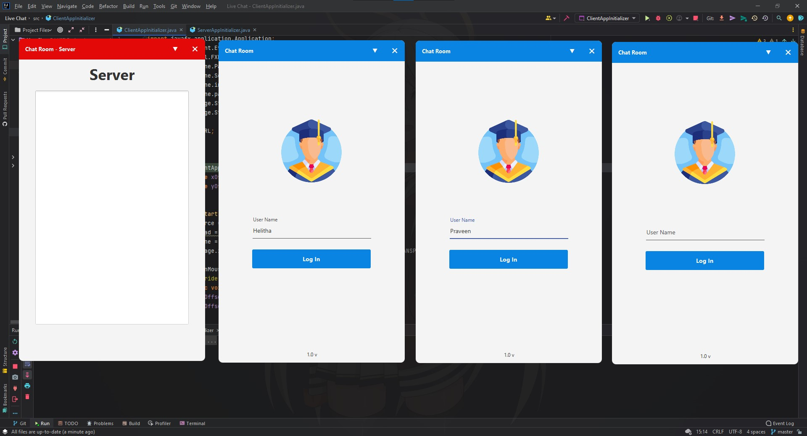
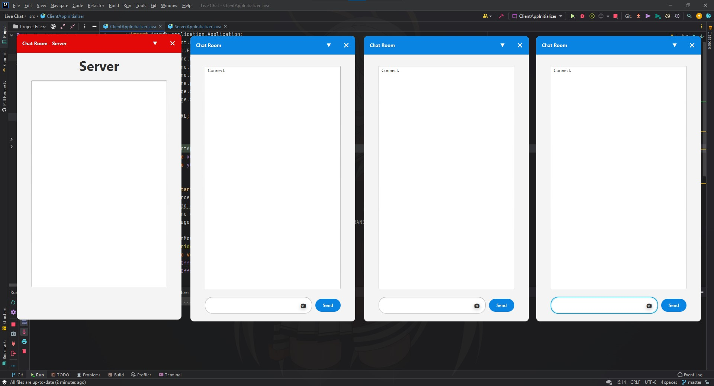
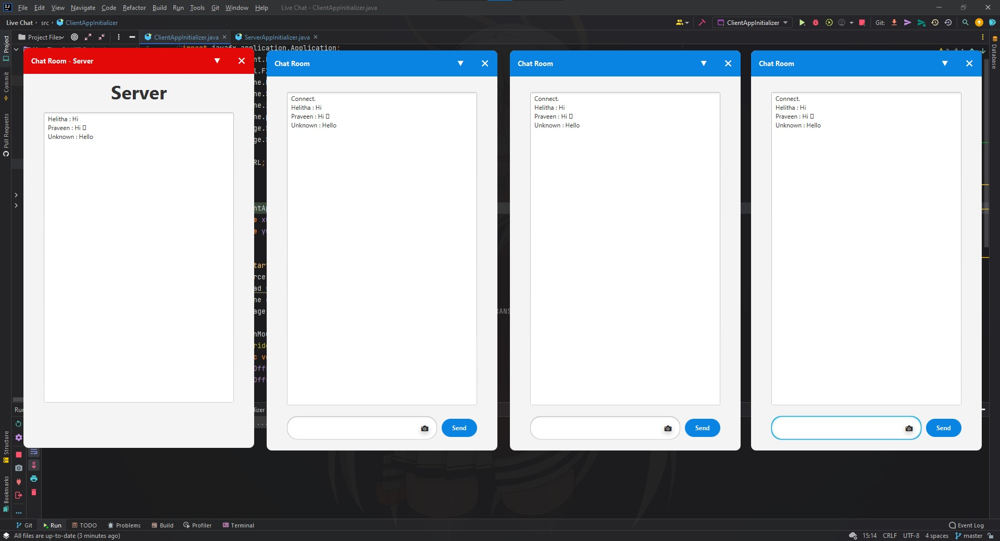

# Live Chat - Group Chat App

### This project's objective is to make a simple group chat app using a Java socket. The chat app has two parts: client and server. It has features like sending images and emojis. I used Java, JavaFX, and Java Socket for this project.

## Tools & Technologies
* Java
* JavaFX
* Java Socket
* CSS

